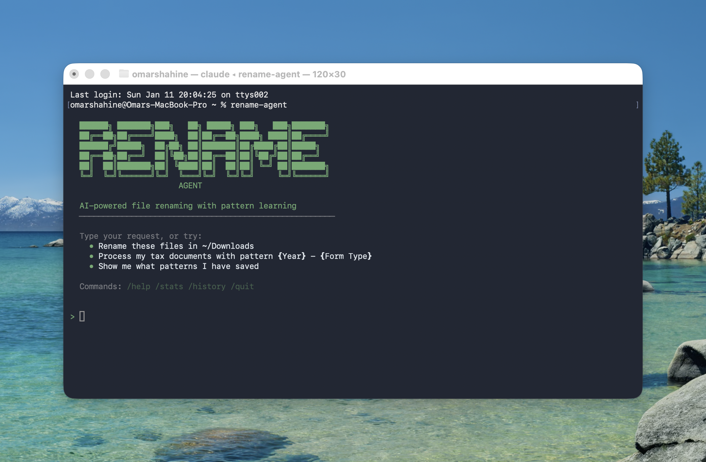

# Rename Agent

An AI-powered file renaming agent built with the Claude Agent SDK. It analyzes documents, classifies them, and applies consistent naming patterns that are learned and remembered over time.



## Features

- **Document Analysis**: Reads PDFs, images, and text files to understand content
- **Smart Classification**: Identifies document types (receipts, bills, tax documents, bank statements, etc.)
- **Pattern-Based Naming**: Uses customizable templates with tokens like `{Date}`, `{Merchant}`, `{Amount}`
- **Pattern Learning**: Saves patterns for future use when processing similar documents
- **Batch Processing**: Process multiple files at once with consistent naming
- **History Tracking**: Keeps track of all renames for reference

## Quick Install

```bash
curl -fsSL https://raw.githubusercontent.com/omarshahine/claude-rename-agent/main/install.sh | bash
```

Or install via pip:

```bash
pip install claude-rename-agent
```

## Claude Code Integration

Add the rename skill to Claude Code and just ask Claude to rename your files. The skill will check if rename-agent is installed and help you set it up if needed.

### Add the Skill

Copy the skill to your Claude Code skills directory:

```bash
# Create the skills directory if it doesn't exist
mkdir -p ~/.claude/skills

# Copy the rename-agent skill
cp -r .claude/skills/rename-agent ~/.claude/skills/
```

Or download directly:

```bash
mkdir -p ~/.claude/skills/rename-agent
curl -fsSL https://raw.githubusercontent.com/omarshahine/claude-rename-agent/main/.claude/skills/rename-agent/SKILL.md \
  -o ~/.claude/skills/rename-agent/SKILL.md
```

### Use It

Once the skill is added, just ask Claude Code to rename your files:

```
> Rename these tax documents in ~/Downloads/tax-forms
> Organize my receipts in ~/Documents/Receipts with date and merchant
> Batch rename PDFs in /path/to/folder using pattern {Date} - {Title}
```

Claude will automatically use the rename skill, check if the tool is installed, help you set it up if needed, and process your files.

## Prerequisites

- **Python 3.10+**
- **Claude Code** - [Install Claude Code](https://claude.ai/code) first
- **Anthropic API Key** - Set `ANTHROPIC_API_KEY` environment variable

<details>
<summary>Manual Installation</summary>

1. Install Python 3.10+ (macOS: `brew install python@3.11`)
2. Install Claude Code: `curl -fsSL https://claude.ai/install.sh | bash`
3. Install the SDK: `pip3 install claude-agent-sdk`
4. Install Rename Agent: `pip3 install claude-rename-agent`

</details>

## Usage

### Interactive Mode

```bash
rename-agent
```

This starts an interactive session where you can describe what you want to rename.

### Single Command

```bash
rename-agent "Rename these 1099 tax forms for 2024" --files /path/to/forms
```

### Process a Folder

```bash
rename-agent --files /path/to/documents
```

### With a Specific Pattern

```bash
rename-agent --files /path/to/receipts --pattern "{Date:YYYY-MM-DD} - {Merchant} - {Amount}"
```

### Dry Run (Preview Only)

```bash
rename-agent --files /path/to/docs --dry-run
```

### View Statistics

```bash
rename-agent stats
```

### View History

```bash
rename-agent history
```

### List Patterns

```bash
rename-agent patterns
```

### List Document Types

```bash
rename-agent types
```

### Preview Files

```bash
rename-agent preview /path/to/folder --ext ".pdf,.jpg" --recursive
```

## Available Tokens

Use these tokens in your naming patterns:

| Token | Description | Example |
|-------|-------------|---------|
| `{Date:YYYY-MM-DD}` | Full date | 2024-03-15 |
| `{Date:YYYY-MM}` | Year and month | 2024-03 |
| `{Date:YYYY}` | Year only | 2024 |
| `{Year}` | Tax/fiscal year | 2024 |
| `{Merchant}` | Business/vendor name | Amazon |
| `{Amount}` | Dollar amount | 125.99 |
| `{Institution}` | Organization name | Chase Bank |
| `{Bank Name}` | Bank name | Wells Fargo |
| `{Service Provider}` | Service provider | Comcast |
| `{Form Type}` | Tax form type | K-1, 1099 |
| `{Account Number}` | Full account number | 1234567890 |
| `{Last 4 Digits}` | Last 4 of account | 7890 |
| `{Description}` | Document description | Annual Statement |
| `{Title}` | Document title | Q4 Report |

## Document Types

The agent recognizes these document types:

- **Receipt** - Purchase receipts, order confirmations
- **Bill** - Utility bills, service statements
- **Tax Document** - W-2, 1099, K-1, tax returns
- **Bank Statement** - Account statements
- **Invoice** - Business invoices
- **Contract** - Legal agreements
- **Medical** - Medical records, EOBs
- **Insurance** - Policies, claims
- **Investment** - Brokerage statements
- **Payslip** - Pay stubs
- **Identity** - IDs, passports, licenses
- **Correspondence** - Letters, notices
- **Manual** - Product manuals
- **Photo** - Images, screenshots
- **General** - Other documents

## Configuration

Patterns and history are stored in `~/.rename-agent/` by default:

- `patterns.json` - Learned naming patterns
- `history.json` - Rename history

Use `--data-dir` to specify a custom location.

## Examples

### Rename Tax Documents

```bash
rename-agent "Rename all 1099 forms using the pattern {Year} - 1099 - {Institution}" \
  --files ~/Documents/Tax/2024/1099s
```

### Process Bank Statements

```bash
rename-agent --files ~/Downloads/statements \
  --pattern "{Date:YYYY-MM} - {Bank Name} - Statement" \
  --type bank_statement
```

### Learn a New Pattern

During interactive mode, the agent will offer to learn patterns when processing batches. You can also explicitly ask:

```
You: Learn this pattern for Chase bank statements: {Date:YYYY-MM} - Chase - Statement - {Last 4 Digits}
```

## How It Works

1. **Analysis**: The agent reads your files and extracts text/images
2. **Classification**: Claude AI identifies the document type and extracts key fields
3. **Pattern Matching**: Finds the best naming pattern (or suggests a new one)
4. **Batch Consistency**: For similar documents, uses the same pattern
5. **Preview**: Shows you all proposed renames before executing
6. **Learning**: Saves patterns that work well for future use

## Development

```bash
# Install in development mode
pip3.11 install -e ".[dev]"

# Run tests
python3.11 -m pytest

# Format code
python3.11 -m black rename_agent/
```

## License

MIT
